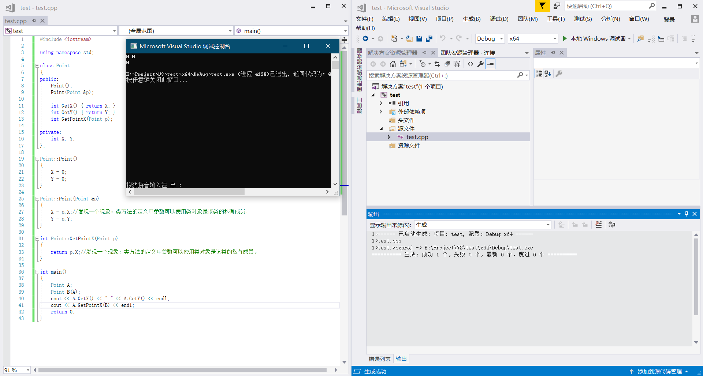

```c++
#include <iostream>	

using namespace std;

class Point
{
public:
	Point();
	Point(Point &p);

	int GetX() { return X; }
	int GetY() { return Y; }
	int GetPointX(Point p);

private:
	int X, Y;
};

Point::Point()
{
	X = 0;
	Y = 0;
}

Point::Point(Point &p)
{
	X = p.X;//发现一个现象：类方法的定义中参数可以使用类对象是该类的私有成员。
	Y = p.Y;
}

int Point::GetPointX(Point p)
{
	return p.X;//发现一个现象：类方法的定义中参数可以使用类对象是该类的私有成员。
}

int main()
{
	Point A;
	Point B(A);
	cout << A.GetX() << " " << A.GetY() << endl;
	cout << A.GetPointX(B) << endl;
	return 0;
}
```

